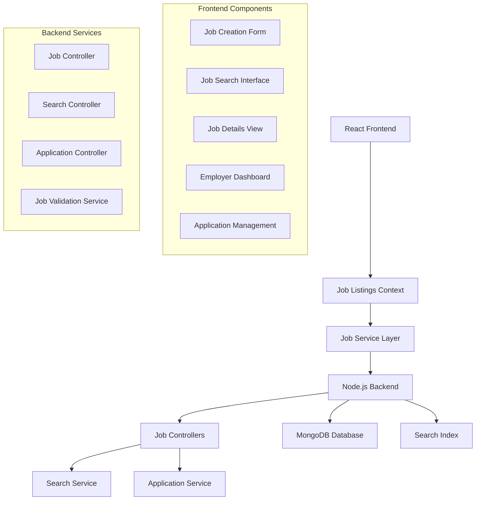

# Design Document: Job Listings System

## Overview

This document outlines the design for a comprehensive job listings management system for the job portal website. The system enables employers to create, edit, and delete job listings while providing job seekers with powerful search and filtering capabilities. The architecture integrates with the existing authentication and profile management systems to provide a complete job matching platform.

## Architecture

The job listings system follows a scalable architecture with search optimization and real-time updates:



**Key Architectural Principles:**
- Role-based access (employers can manage their jobs, job seekers can search and apply)
- Full-text search with filtering and sorting capabilities
- Job status lifecycle management (Draft, Published, Closed, Expired)
- Integration with profile system for application management
- Real-time notifications for job updates and applications

## Components and Interfaces

### Frontend Components

#### Job Listings Context Provider
```typescript
interface JobListingsContextType {
  jobs: JobListing[];
  loading: boolean;
  searchResults: JobListing[];
  createJob: (jobData: CreateJobData) => Promise<boolean>;
  updateJob: (jobId: string, jobData: Partial<JobListing>) => Promise<boolean>;
  deleteJob: (jobId: string) => Promise<boolean>;
  searchJobs: (criteria: SearchCriteria) => Promise<JobListing[]>;
  getJobById: (jobId: string) => Promise<JobListing>;
  applyToJob: (jobId: string, applicationData: ApplicationData) => Promise<boolean>;
}
```

#### Job Creation Form Component
```typescript
interface JobFormProps {
  job?: JobListing; // For editing existing jobs
  onSave?: (job: JobListing) => void;
  onError?: (error: string) => void;
}

interface CreateJobData {
  title: string;
  description: string;
  qualifications: string[];
  responsibilities: string[];
  location: JobLocation;
  salaryRange?: SalaryRange;
  jobType: JobType;
  experienceLevel: ExperienceLevel;
  applicationDeadline?: Date;
  skills: string[];
}
```

#### Job Search Component
```typescript
interface JobSearchProps {
  onSearchResults?: (results: JobListing[]) => void;
  initialCriteria?: SearchCriteria;
}

interface SearchCriteria {
  keywords?: string;
  location?: string;
  jobType?: JobType[];
  experienceLevel?: ExperienceLevel[];
  salaryRange?: SalaryRange;
  skills?: string[];
  companySize?: CompanySize[];
  postedWithin?: number; // days
}
```

#### Job Details Component
```typescript
interface JobDetailsProps {
  jobId: string;
  onApply?: (jobId: string) => void;
  onSave?: (jobId: string) => void;
  showApplicationButton?: boolean;
}
```

### Backend Components

#### Job Model (MongoDB Schema)
```javascript
const jobListingSchema = {
  employerId: { type: ObjectId, ref: 'User', required: true },
  title: { type: String, required: true, maxlength: 100 },
  description: { type: String, required: true, maxlength: 5000 },
  qualifications: [{ type: String }],
  responsibilities: [{ type: String }],
  location: {
    city: { type: String, required: true },
    state: { type: String, required: true },
    country: { type: String, required: true },
    remote: { type: Boolean, default: false },
    hybrid: { type: Boolean, default: false },
    onSite: { type: Boolean, default: true }
  },
  salaryRange: {
    min: { type: Number },
    max: { type: Number },
    currency: { type: String, default: 'USD' },
    period: { type: String, enum: ['hourly', 'monthly', 'annually'] },
    negotiable: { type: Boolean, default: false }
  },
  jobType: { 
    type: String, 
    enum: ['full-time', 'part-time', 'contract', 'internship', 'remote'],
    required: true 
  },
  experienceLevel: {
    type: String,
    enum: ['entry', 'mid', 'senior', 'executive'],
    required: true
  },
  skills: [{ type: String }],
  status: {
    type: String,
    enum: ['draft', 'published', 'closed', 'expired'],
    default: 'draft'
  },
  applicationDeadline: { type: Date },
  applicationsCount: { type: Number, default: 0 },
  viewsCount: { type: Number, default: 0 },
  createdAt: { type: Date, default: Date.now },
  updatedAt: { type: Date, default: Date.now },
  expiresAt: { type: Date } // Auto-expire after 90 days
};
```

#### Job Controller
```javascript
class JobController {
  async createJob(req, res);
  async updateJob(req, res);
  async deleteJob(req, res);
  async getJob(req, res);
  async getEmployerJobs(req, res);
  async searchJobs(req, res);
  async updateJobStatus(req, res);
  async getJobStats(req, res);
}
```

#### Search Service
```javascript
class SearchService {
  async searchJobs(criteria, pagination);
  async buildSearchQuery(criteria);
  async applyFilters(query, filters);
  async sortResults(results, sortBy);
  async getSearchSuggestions(query);
  async indexJob(job);
  async removeFromIndex(jobId);
}
```

## Data Models

### Core Job Entities

#### Job Location Schema
```typescript
interface JobLocation {
  city: string;
  state: string;
  country: string;
  remote: boolean;
  hybrid: boolean;
  onSite: boolean;
  requiredOfficeDays?: number; // For hybrid positions
}
```

#### Salary Range Schema
```typescript
interface SalaryRange {
  min?: number;
  max?: number;
  currency: string;
  period: 'hourly' | 'monthly' | 'annually';
  negotiable: boolean;
  showSalary: boolean; // Privacy setting
}
```

#### Job Application Schema
```typescript
interface JobApplication {
  jobId: string;
  applicantId: string;
  coverLetter?: string;
  resumeId: string;
  status: 'pending' | 'reviewed' | 'shortlisted' | 'rejected' | 'hired';
  appliedAt: Date;
  reviewedAt?: Date;
  notes?: string; // Employer notes
}
```

## Correctness Properties

*A property is a characteristic or behavior that should hold true across all valid executions of a system-essentially, a formal statement about what the system should do. Properties serve as the bridge between human-readable specifications and machine-verifiable correctness guarantees.*
### Property 1: Job Creation Validation
*For any* job listing creation attempt, the system should require title, description, and location as mandatory fields, validate all input data, and assign unique identifiers with creation timestamps.
**Validates: Requirements 1.1, 1.2, 1.5**

### Property 2: Job Information Management
*For any* job listing, the system should enforce character limits (100 for title, 5000 for description), validate job type and experience level enums, and allow proper management of qualifications, responsibilities, and skills.
**Validates: Requirements 1.3, 2.1, 2.2, 2.3, 2.4, 2.5**

### Property 3: Draft and Publishing Workflow
*For any* job listing, the system should allow saving as draft, publishing when ready, and maintaining proper status throughout the lifecycle.
**Validates: Requirements 1.6, 4.3**

### Property 4: Application Deadline Validation
*For any* job listing with an application deadline, the system should validate that the deadline is in the future and properly manage deadline-based application acceptance.
**Validates: Requirements 2.6, 2.7**

### Property 5: Job Editing and Updates
*For any* job listing edit, the system should preserve creation date, update modification timestamp, allow editing all fields except ID, maintain status unless explicitly changed, and validate using the same rules as creation.
**Validates: Requirements 3.1, 3.2, 3.3, 3.6**

### Property 6: Revision Tracking and Notifications
*For any* published job listing that is edited, the system should track revision history with timestamps and notify existing applicants of significant changes.
**Validates: Requirements 3.4, 3.5**

### Property 7: Job Deletion and Status Management
*For any* job listing deletion or status change, the system should enforce ownership authorization, implement soft deletion preserving application data, and properly manage status transitions (draft, published, closed, expired).
**Validates: Requirements 4.1, 4.2, 4.3**

### Property 8: Application Control and Expiration
*For any* job listing, the system should stop accepting applications when closed, automatically expire jobs after 90 days, and notify employers of expiration with renewal options.
**Validates: Requirements 4.4, 4.5, 4.6**

### Property 9: Location Management
*For any* job location specification, the system should validate location information, support remote work options (on-site, remote, hybrid), allow multiple locations, and support international formats.
**Validates: Requirements 5.1, 5.2, 5.3, 5.4, 5.5, 5.6**

### Property 10: Salary Range Validation
*For any* salary range specification, the system should validate that minimum is less than maximum, support different salary periods, allow negotiable salary settings, and provide privacy controls for salary visibility.
**Validates: Requirements 6.1, 6.2, 6.3, 6.4, 6.5, 6.6**

### Property 11: Job Search and Filtering
*For any* job search query, the system should search across titles and descriptions, apply filters correctly (location, job type, experience level, salary range), and return results ranked by relevance and recency.
**Validates: Requirements 7.1, 7.2, 7.3**

### Property 12: Advanced Search Features
*For any* advanced search operation, the system should support saved search criteria with notifications, provide advanced filtering options, and display search results with all key information.
**Validates: Requirements 7.4, 7.5, 7.6**

### Property 13: Job Display and Metadata
*For any* job listing view, the system should display all job information clearly, show metadata (posting date, deadline, applicant count), display employer information with profile links, and track view counts.
**Validates: Requirements 8.2, 8.3, 8.6**

### Property 14: Social Features and Related Jobs
*For any* job listing, the system should provide social sharing options and show related job listings from the same employer or similar roles.
**Validates: Requirements 8.4, 8.5**

### Property 15: Application Management
*For any* job application attempt, the system should require complete profiles, allow cover letters, prevent duplicate applications, send confirmation emails, and notify employers of new applications.
**Validates: Requirements 9.1, 9.2, 9.3, 9.4, 9.5, 9.6**

### Property 16: Security and Authorization
*For any* job listing operation, the system should validate inputs to prevent XSS/injection attacks, implement rate limiting, require employer verification, flag inappropriate content, and enforce proper authorization.
**Validates: Requirements 10.1, 10.2, 10.3, 10.4, 10.6**

### Property 17: Audit and Monitoring
*For any* job listing operation, the system should log all operations for audit and monitoring purposes.
**Validates: Requirements 10.5**

## Error Handling

The job listings system implements comprehensive error handling:

### Frontend Error Handling
- **Form Validation Errors**: Display field-level validation messages
- **Search Errors**: Handle search failures with fallback options
- **Application Errors**: Show clear messages for application failures
- **Network Errors**: Implement retry mechanisms for failed requests

### Backend Error Handling
- **Validation Errors**: Return structured validation responses
- **Authorization Errors**: Log security violations, return generic messages
- **Database Errors**: Handle connection issues and constraint violations
- **Search Service Errors**: Fallback to basic search when advanced search fails

### Job Status Error Handling
```typescript
interface JobStatusError {
  code: 'INVALID_STATUS_TRANSITION' | 'UNAUTHORIZED_ACCESS' | 'JOB_EXPIRED' | 'APPLICATION_CLOSED';
  message: string;
  currentStatus?: JobStatus;
  allowedTransitions?: JobStatus[];
}
```

## Testing Strategy

The job listings system will use comprehensive testing combining unit tests and property-based tests.

### Property-Based Testing
Property-based tests will validate universal properties using **fast-check** library with minimum 100 iterations per test.

**Property Test Coverage:**
- Job creation and validation with generated job data
- Search functionality with various search criteria and filters
- Job status transitions and lifecycle management
- Application management with generated application scenarios
- Authorization and security with various user permission scenarios

### Unit Testing
Unit tests will verify specific examples and edge cases:

**Frontend Unit Tests:**
- Job form component rendering and validation
- Search interface functionality
- Job details display
- Application process components

**Backend Unit Tests:**
- Job controller endpoint responses
- Search service functionality
- Application management
- Authorization middleware

### Integration Testing
- Complete job creation and management flows
- Search and filtering across large datasets
- Application submission and notification processes
- Job expiration and renewal workflows

### Search Performance Testing
- Search response time with large job datasets
- Filter performance with multiple criteria
- Search result ranking accuracy
- Pagination and sorting functionality

### Test Organization
```
tests/
├── unit/
│   ├── frontend/
│   │   ├── components/
│   │   └── services/
│   └── backend/
│       ├── controllers/
│       ├── services/
│       └── middleware/
├── property/
│   ├── job-management.property.test.js
│   ├── job-search.property.test.js
│   └── application-management.property.test.js
└── integration/
    ├── job-lifecycle.test.js
    ├── search-functionality.test.js
    └── application-process.test.js
```

### Performance Testing
- Load testing for job search with concurrent users
- Database performance testing with large job datasets
- Search index performance and optimization
- Application submission performance under load