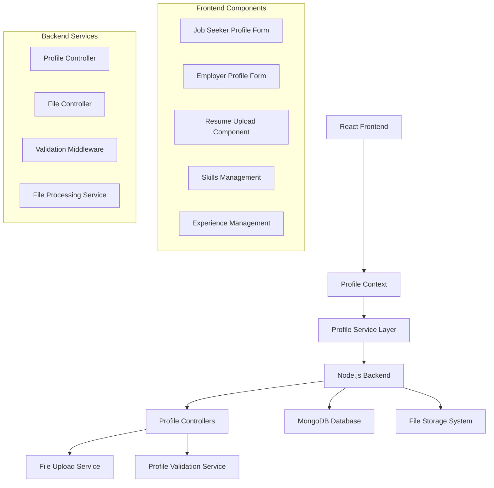

# Design Document: Profile Management System

## Overview

This document outlines the design for a comprehensive profile management system for the job portal website. The system enables both job seekers and employers to create, manage, and maintain detailed profiles with secure file upload capabilities, privacy controls, and data validation. The architecture integrates seamlessly with the existing authentication system and provides a foundation for job matching and application processes.

## Architecture

The profile management system follows a modular architecture with clear separation between job seeker and employer profile functionality:



**Key Architectural Principles:**
- Role-based profile management (job seekers vs employers)
- Secure file upload and storage with virus scanning
- Progressive profile completion with validation
- Privacy controls and visibility settings
- Integration with existing authentication system

## Components and Interfaces

### Frontend Components

#### Profile Context Provider
```typescript
interface ProfileContextType {
  profile: JobSeekerProfile | EmployerProfile | null;
  loading: boolean;
  updateProfile: (profileData: Partial<Profile>) => Promise<boolean>;
  uploadResume: (file: File) => Promise<boolean>;
  deleteResume: () => Promise<boolean>;
  getProfileCompleteness: () => number;
  refreshProfile: () => Promise<void>;
}
```

#### Job Seeker Profile Form Component
```typescript
interface JobSeekerProfileProps {
  onSave?: (profile: JobSeekerProfile) => void;
  onError?: (error: string) => void;
}

interface JobSeekerProfile {
  personalInfo: {
    fullName: string;
    email: string;
    phone: string;
    address: Address;
    summary: string;
  };
  skills: Skill[];
  experience: WorkExperience[];
  education: Education[];
  resume?: ResumeFile;
  privacy: PrivacySettings;
}
```

#### Employer Profile Form Component
```typescript
interface EmployerProfileProps {
  onSave?: (profile: EmployerProfile) => void;
  onError?: (error: string) => void;
}

interface EmployerProfile {
  companyInfo: {
    companyName: string;
    industry: string;
    companySize: CompanySize;
    website: string;
    description: string;
    address: Address;
  };
  contactInfo: ContactInfo;
  privacy: PrivacySettings;
}
```

#### Resume Upload Component
```typescript
interface ResumeUploadProps {
  onUploadSuccess?: (file: ResumeFile) => void;
  onUploadError?: (error: string) => void;
  maxSize?: number; // Default 5MB
  acceptedFormats?: string[]; // Default: PDF, DOC, DOCX
}

interface ResumeFile {
  id: string;
  filename: string;
  originalName: string;
  size: number;
  mimeType: string;
  uploadDate: Date;
  downloadUrl: string;
}
```

### Backend Components

#### Profile Model (MongoDB Schema)
```javascript
const jobSeekerProfileSchema = {
  userId: { type: ObjectId, ref: 'User', required: true, unique: true },
  personalInfo: {
    fullName: { type: String, required: true },
    phone: { type: String, required: true },
    address: addressSchema,
    summary: { type: String, maxlength: 500 }
  },
  skills: [skillSchema],
  experience: [experienceSchema],
  education: [educationSchema],
  resume: resumeSchema,
  privacy: privacySchema,
  completeness: { type: Number, default: 0 },
  lastModified: { type: Date, default: Date.now }
};

const employerProfileSchema = {
  userId: { type: ObjectId, ref: 'User', required: true, unique: true },
  companyInfo: {
    companyName: { type: String, required: true },
    industry: { type: String, required: true },
    companySize: { type: String, enum: ['1-10', '11-50', '51-200', '201-1000', '1000+'] },
    website: { type: String, validate: urlValidator },
    description: { type: String, maxlength: 1000 },
    address: addressSchema
  },
  contactInfo: contactSchema,
  privacy: privacySchema,
  completeness: { type: Number, default: 0 },
  lastModified: { type: Date, default: Date.now }
};
```

#### Profile Controller
```javascript
class ProfileController {
  async getProfile(req, res);
  async updateProfile(req, res);
  async uploadResume(req, res);
  async downloadResume(req, res);
  async deleteResume(req, res);
  async getProfileCompleteness(req, res);
  async updatePrivacySettings(req, res);
}
```

#### File Upload Service
```javascript
class FileUploadService {
  async uploadFile(file, userId, fileType);
  async deleteFile(fileId, userId);
  async getFileUrl(fileId, userId);
  async scanFileForVirus(filePath);
  async validateFileType(file, allowedTypes);
  async generateUniqueFileName(originalName);
}
```

## Data Models

### Core Profile Entities

#### Address Schema
```typescript
interface Address {
  street?: string;
  city: string;
  state: string;
  postalCode: string;
  country: string;
}
```

#### Skill Schema
```typescript
interface Skill {
  name: string;
  proficiency: 'Beginner' | 'Intermediate' | 'Advanced' | 'Expert';
  yearsOfExperience?: number;
}
```

#### Work Experience Schema
```typescript
interface WorkExperience {
  company: string;
  jobTitle: string;
  startDate: Date;
  endDate?: Date; // null for current positions
  isCurrent: boolean;
  description: string;
  location?: string;
}
```

#### Education Schema
```typescript
interface Education {
  institution: string;
  degree: string;
  fieldOfStudy: string;
  graduationYear: number;
  gpa?: number;
}
```

#### Privacy Settings Schema
```typescript
interface PrivacySettings {
  profileVisibility: 'Public' | 'Private' | 'Employers Only';
  showContactInfo: boolean;
  showCurrentEmployer: boolean;
  showResume: boolean;
  allowContactFromEmployers: boolean;
}
```

## Correctness Properties

*A property is a characteristic or behavior that should hold true across all valid executions of a system-essentially, a formal statement about what the system should do. Properties serve as the bridge between human-readable specifications and machine-verifiable correctness guarantees.*
### Property 1: Profile Update Validation
*For any* valid profile data (job seeker or employer), updating a profile should successfully save all changes to the database and update the last modified timestamp.
**Validates: Requirements 1.2, 1.5, 4.2**

### Property 2: Required Field Enforcement
*For any* profile submission missing required fields (full name, email, phone for job seekers; company name, industry, contact info for employers), the system should reject the submission and display specific validation errors.
**Validates: Requirements 1.4, 4.3, 7.3**

### Property 3: Input Validation and Sanitization
*For any* invalid profile data (malformed emails, invalid URLs, XSS attempts), the system should reject the input, sanitize text content, and display appropriate validation error messages.
**Validates: Requirements 1.3, 4.5, 5.1, 7.4, 7.5**

### Property 4: Character Limit Enforcement
*For any* text input with defined limits (500 chars for job seeker summary, 1000 chars for company description), the system should enforce the limits and reject inputs that exceed them.
**Validates: Requirements 1.6, 4.4**

### Property 5: File Upload Validation
*For any* file upload attempt, the system should only accept PDF, DOC, and DOCX formats under 5MB, reject invalid or corrupted files, and generate unique file names for successful uploads.
**Validates: Requirements 2.1, 2.2, 2.6, 2.7**

### Property 6: Resume Management
*For any* resume upload by a job seeker, the system should replace any existing resume, store the file securely associated with the user's profile, and allow the user to download it later.
**Validates: Requirements 2.3, 2.4, 2.5**

### Property 7: Skills and Experience Management
*For any* skills or work experience entry, the system should prevent duplicate skills, validate date ranges (start date before end date), and allow proper management of current positions and proficiency levels.
**Validates: Requirements 3.1, 3.2, 3.3, 3.4, 3.6**

### Property 8: Education Management
*For any* education entry, the system should allow adding complete education information with institution, degree, field of study, and graduation year.
**Validates: Requirements 3.5**

### Property 9: Contact Information Validation
*For any* contact information update (email, phone, address), the system should validate formats according to international standards, send verification emails for email changes, and allow setting contact preferences.
**Validates: Requirements 5.1, 5.2, 5.3, 5.4, 5.5, 5.6**

### Property 10: Privacy Controls
*For any* privacy setting change, the system should enforce the selected visibility level (Public, Private, Employers Only), control contact information visibility, and respect privacy settings in search results.
**Validates: Requirements 6.1, 6.2, 6.3, 6.4, 6.5, 6.6**

### Property 11: Profile Completeness Calculation
*For any* profile state, the system should accurately calculate completion percentage based on filled fields and provide appropriate suggestions for improving completeness.
**Validates: Requirements 7.1, 7.2**

### Property 12: Date Validation
*For any* date input, the system should validate date formats and ensure logical date ranges (graduation years, work experience dates).
**Validates: Requirements 7.6**

### Property 13: File Security and Access Control
*For any* file operation, the system should store files securely, scan for malware, generate unique identifiers, implement proper access controls, and log all operations for audit purposes.
**Validates: Requirements 8.1, 8.2, 8.3, 8.4, 8.5**

### Property 14: File Cleanup on Account Deactivation
*For any* user account deactivation, the system should automatically delete all associated uploaded files to prevent data retention issues.
**Validates: Requirements 8.6**

## Error Handling

The profile management system implements comprehensive error handling:

### Frontend Error Handling
- **File Upload Errors**: Display specific messages for file type, size, and corruption issues
- **Validation Errors**: Show field-level validation messages with clear guidance
- **Network Errors**: Handle connection issues with retry mechanisms
- **Form State Management**: Preserve form data during error scenarios

### Backend Error Handling
- **File Processing Errors**: Log detailed errors, return user-friendly messages
- **Database Errors**: Handle connection issues and constraint violations
- **Validation Errors**: Return structured validation responses
- **Security Errors**: Log security violations, return generic error messages

### File Upload Error Handling
```typescript
interface FileUploadError {
  code: 'FILE_TOO_LARGE' | 'INVALID_FORMAT' | 'VIRUS_DETECTED' | 'UPLOAD_FAILED';
  message: string;
  maxSize?: number;
  allowedFormats?: string[];
}
```

## Testing Strategy

The profile management system will use a comprehensive testing approach combining unit tests and property-based tests.

### Property-Based Testing
Property-based tests will validate universal properties using **fast-check** library with minimum 100 iterations per test.

**Property Test Coverage:**
- Profile data validation with generated valid/invalid inputs
- File upload validation with various file types and sizes
- Privacy setting enforcement across different user scenarios
- Profile completeness calculation with various completion states
- Date validation with generated date ranges and formats

### Unit Testing
Unit tests will verify specific examples and edge cases:

**Frontend Unit Tests:**
- Profile form component rendering and interaction
- File upload component behavior
- Privacy setting controls
- Profile completeness display

**Backend Unit Tests:**
- Profile controller endpoint responses
- File upload middleware functionality
- Validation middleware behavior
- Database model constraints

### Integration Testing
- Complete profile creation and update flows
- File upload and download processes
- Privacy setting enforcement across the system
- Profile search and visibility controls

### File Upload Testing
- Virus scanning integration testing
- File storage and retrieval testing
- Access control verification
- File cleanup on account deletion

### Test Organization
```
tests/
├── unit/
│   ├── frontend/
│   │   ├── components/
│   │   └── services/
│   └── backend/
│       ├── controllers/
│       ├── middleware/
│       └── models/
├── property/
│   ├── profile-validation.property.test.js
│   ├── file-upload.property.test.js
│   └── privacy-controls.property.test.js
└── integration/
    ├── profile-management.test.js
    └── file-operations.test.js
```