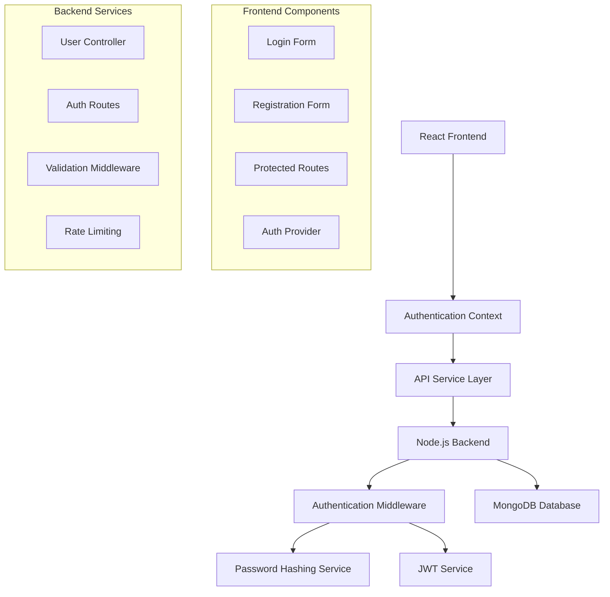

# Design Document: User Authentication System

## Overview

This document outlines the design for a secure user authentication system for a job portal website. The system implements JWT-based authentication with React frontend and Node.js backend, featuring user registration, login, secure password storage, and session management. The architecture follows modern security best practices including bcrypt password hashing, proper token management, and comprehensive input validation.

## Architecture

The authentication system follows a client-server architecture with clear separation of concerns:



**Key Architectural Principles:**
- Stateless authentication using JWT tokens
- Secure password storage with bcrypt hashing
- Context-based state management in React
- Middleware-based request validation and authentication
- Environment-based configuration management

## Components and Interfaces

### Frontend Components

#### AuthContext Provider
```typescript
interface AuthContextType {
  user: User | null;
  token: string | null;
  login: (email: string, password: string) => Promise<boolean>;
  register: (userData: RegisterData) => Promise<boolean>;
  logout: () => void;
  isAuthenticated: boolean;
  loading: boolean;
}
```

**Responsibilities:**
- Manage authentication state across the application
- Handle token storage and retrieval from localStorage
- Provide authentication methods to child components
- Automatically validate token on app initialization

#### Registration Form Component
```typescript
interface RegisterFormProps {
  onSuccess?: () => void;
  onError?: (error: string) => void;
}

interface RegisterData {
  email: string;
  password: string;
  confirmPassword: string;
  fullName: string;
  userType: 'jobseeker' | 'employer';
}
```

**Features:**
- Real-time form validation
- Password strength indicator
- User type selection
- Responsive design
- Loading states during submission

#### Login Form Component
```typescript
interface LoginFormProps {
  onSuccess?: () => void;
  onError?: (error: string) => void;
}

interface LoginData {
  email: string;
  password: string;
}
```

**Features:**
- Email and password validation
- Remember me functionality
- Forgot password link
- Error message display
- Loading states

#### Protected Route Component
```typescript
interface ProtectedRouteProps {
  children: React.ReactNode;
  requiredRole?: 'jobseeker' | 'employer';
  redirectTo?: string;
}
```

**Functionality:**
- Check authentication status
- Verify user roles if specified
- Redirect unauthenticated users
- Handle token expiration

### Backend Components

#### User Model (MongoDB Schema)
```javascript
const userSchema = {
  email: { type: String, required: true, unique: true },
  password: { type: String, required: true },
  fullName: { type: String, required: true },
  userType: { type: String, enum: ['jobseeker', 'employer'], required: true },
  createdAt: { type: Date, default: Date.now },
  lastLogin: { type: Date },
  isActive: { type: Boolean, default: true }
}
```

#### Authentication Controller
```javascript
class AuthController {
  async register(req, res);
  async login(req, res);
  async logout(req, res);
  async getProfile(req, res);
  async refreshToken(req, res);
}
```

**Methods:**
- `register`: Handle user registration with validation
- `login`: Authenticate user and generate JWT
- `logout`: Invalidate user session
- `getProfile`: Return authenticated user data
- `refreshToken`: Generate new JWT for valid sessions

#### JWT Service
```javascript
class JWTService {
  generateToken(payload, expiresIn = '24h');
  verifyToken(token);
  decodeToken(token);
}
```

#### Password Service
```javascript
class PasswordService {
  async hashPassword(password, saltRounds = 12);
  async comparePassword(password, hashedPassword);
  validatePasswordStrength(password);
}
```

## Data Models

### User Entity
```typescript
interface User {
  _id: string;
  email: string;
  fullName: string;
  userType: 'jobseeker' | 'employer';
  createdAt: Date;
  lastLogin?: Date;
  isActive: boolean;
}
```

### JWT Payload
```typescript
interface JWTPayload {
  userId: string;
  email: string;
  userType: string;
  iat: number;
  exp: number;
}
```

### API Request/Response Models

#### Registration Request
```typescript
interface RegisterRequest {
  email: string;
  password: string;
  fullName: string;
  userType: 'jobseeker' | 'employer';
}
```

#### Authentication Response
```typescript
interface AuthResponse {
  success: boolean;
  message: string;
  user?: User;
  token?: string;
}
```

## Correctness Properties

*A property is a characteristic or behavior that should hold true across all valid executions of a system-essentially, a formal statement about what the system should do. Properties serve as the bridge between human-readable specifications and machine-verifiable correctness guarantees.*

### Property 1: User Registration Success
*For any* valid user registration data (email, password, full name, user type), the system should successfully create a new user account with all provided information stored correctly and the user automatically authenticated.
**Validates: Requirements 1.1, 1.6**

### Property 2: Email Uniqueness Enforcement
*For any* email address, if a user account already exists with that email, attempting to register another account with the same email should be rejected with an appropriate error message.
**Validates: Requirements 1.2, 8.2**

### Property 3: Registration Input Validation
*For any* invalid registration data (missing required fields, malformed email, etc.), the system should reject the registration attempt and display specific validation error messages.
**Validates: Requirements 1.3, 5.5**

### Property 4: Password Security Requirements
*For any* password, the system should enforce that it contains at least 8 characters, one uppercase letter, one lowercase letter, and one number, rejecting passwords that don't meet these criteria.
**Validates: Requirements 1.4, 1.5, 5.1, 5.2, 5.3, 5.4**

### Property 5: Secure Password Storage
*For any* user password, when stored in the database, it should be hashed using bcrypt with at least 12 salt rounds, never stored in plain text, and each password should have a unique salt.
**Validates: Requirements 2.1, 2.2, 2.4**

### Property 6: Secure Password Comparison
*For any* login attempt, password comparison should use bcrypt's secure comparison methods to prevent timing attacks.
**Validates: Requirements 2.3**

### Property 7: Successful Authentication Flow
*For any* valid user credentials (existing email and correct password), the login process should authenticate the user, generate a valid JWT token with 24-hour expiration, and create an authenticated session.
**Validates: Requirements 3.1, 3.3, 4.1**

### Property 8: Authentication Failure Handling
*For any* invalid login credentials, the system should reject the authentication attempt and display a generic error message without revealing whether the email exists.
**Validates: Requirements 3.2**

### Property 9: Rate Limiting Protection
*For any* IP address, the system should limit login attempts to maximum 5 failed attempts per 15-minute window to prevent brute force attacks.
**Validates: Requirements 3.5**

### Property 10: JWT Token Validation
*For any* request to protected endpoints, the system should validate the JWT token and reject requests with invalid, expired, or missing tokens, redirecting to the login page.
**Validates: Requirements 4.2, 4.4, 4.5, 7.5**

### Property 11: Session Logout
*For any* authenticated user, when they log out, their session should be immediately invalidated and they should be redirected to the login page.
**Validates: Requirements 4.3**

### Property 12: Form Validation Feedback
*For any* form submission with validation errors, the system should display clear error messages next to the relevant fields and show loading states during submission.
**Validates: Requirements 6.3, 6.4**

### Property 13: Input Sanitization Security
*For any* user input, the system should validate and sanitize the data to prevent injection attacks and implement proper error handling without exposing sensitive system information.
**Validates: Requirements 7.2, 7.4**

### Property 14: CORS Security
*For any* cross-origin request, the system should enforce CORS policies to prevent unauthorized access from different domains.
**Validates: Requirements 7.1**

### Property 15: Database Data Integrity
*For any* user record stored in the database, it should conform to the defined schema with proper validation, include creation and last login timestamps, and support proper connection error handling.
**Validates: Requirements 8.1, 8.3, 8.4**

### Property 16: Environment Configuration
*For any* database configuration, the system should load connection settings from environment variables rather than hardcoded values.
**Validates: Requirements 8.5**

## Error Handling

The authentication system implements comprehensive error handling across all layers:

### Frontend Error Handling
- **Network Errors**: Display user-friendly messages for connection issues
- **Validation Errors**: Show specific field-level validation messages
- **Authentication Errors**: Display generic error messages for security
- **Token Expiration**: Automatically redirect to login and clear stored tokens

### Backend Error Handling
- **Database Errors**: Log detailed errors server-side, return generic messages to client
- **Validation Errors**: Return structured validation error responses
- **Authentication Errors**: Return consistent error format without revealing system details
- **Rate Limiting**: Return 429 status with retry-after headers

### Error Response Format
```typescript
interface ErrorResponse {
  success: false;
  message: string;
  errors?: {
    field: string;
    message: string;
  }[];
  code?: string;
}
```

## Testing Strategy

The authentication system will be validated using a dual testing approach combining unit tests and property-based tests to ensure comprehensive coverage and correctness.

### Property-Based Testing
Property-based tests will validate universal properties across all inputs using **fast-check** library for JavaScript/TypeScript. Each property test will run a minimum of 100 iterations to ensure thorough coverage.

**Configuration:**
- Library: fast-check for Node.js backend, @fast-check/jest for React frontend
- Iterations: Minimum 100 per property test
- Test tagging format: **Feature: user-authentication, Property {number}: {property_text}**

**Property Test Coverage:**
- User registration with generated valid/invalid data
- Password validation across all possible input combinations
- JWT token generation and validation with various payloads
- Database operations with generated user data
- API endpoint security with various request patterns

### Unit Testing
Unit tests will verify specific examples, edge cases, and integration points:

**Frontend Unit Tests (Jest + React Testing Library):**
- Form component rendering and interaction
- Authentication context state management
- Protected route behavior
- API service error handling

**Backend Unit Tests (Jest + Supertest):**
- API endpoint responses for specific scenarios
- Middleware functionality
- Database model validation
- Error handling edge cases

**Integration Testing:**
- End-to-end authentication flows
- Database connection and operations
- API security middleware chain
- Frontend-backend communication

### Test Organization
```
tests/
├── unit/
│   ├── frontend/
│   │   ├── components/
│   │   ├── context/
│   │   └── services/
│   └── backend/
│       ├── controllers/
│       ├── middleware/
│       └── models/
├── property/
│   ├── authentication.property.test.js
│   ├── validation.property.test.js
│   └── security.property.test.js
└── integration/
    ├── auth-flow.test.js
    └── api-security.test.js
```

### Testing Best Practices
- **No Mocking for Core Logic**: Property tests validate real functionality without mocks
- **Smart Test Data Generation**: Use constrained generators that produce realistic test data
- **Security-First Testing**: Prioritize testing security properties and edge cases
- **Performance Considerations**: Include tests for rate limiting and token validation performance
- **Error Scenario Coverage**: Test all error conditions and edge cases thoroughly